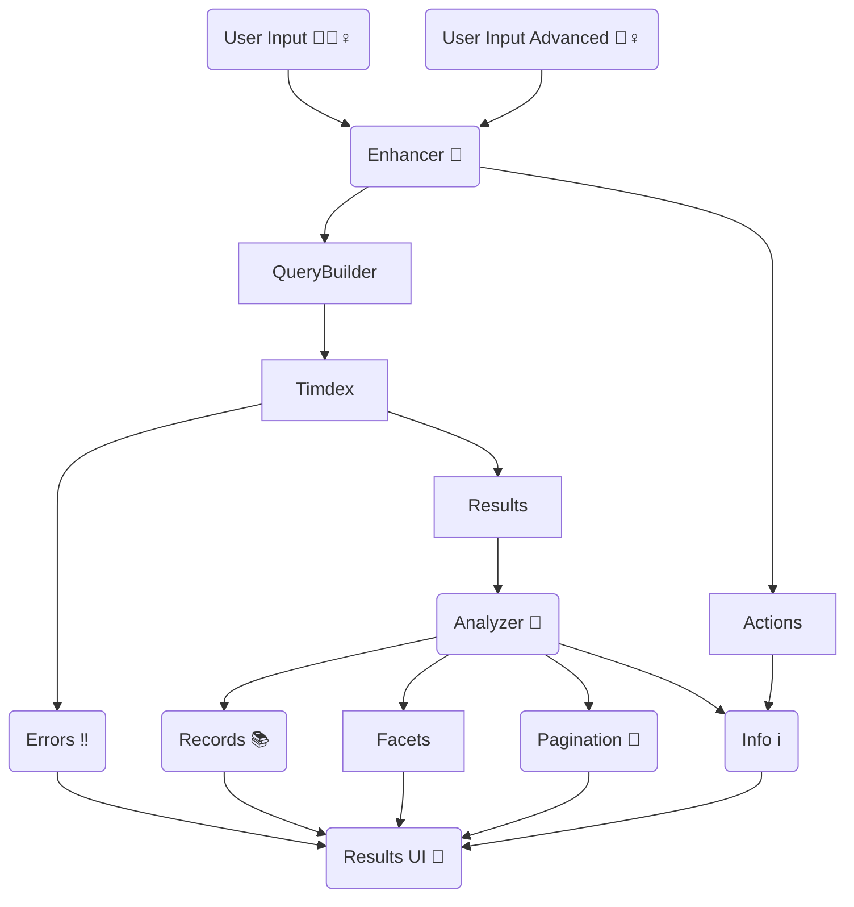

[](https://codeclimate.com/github/MITLibraries/timdex-ui/maintainability)

# TIMDEX UI

A discovery interface backed by [the TIMDEX API](https://github.com/MITLibraries/timdex).

## Architecture decision records (ADRs)

This repository contains ADRs in the docs/architecture-decisions directory.

adr-tools should allow easy creation of additional records with a standardized template.

## TIMDEX UI Flow Diagram

Note: this is a logical flow diagram and not a direct representation of object relationships. It is also a guide, not
a set of rules to follow. If implementation is done differently, please update this diagram to reflect that intentional
change as part of the work.



## Developer notes

### Confirming functionality after dependency updates

This application has test coverage >95%, so running the test suite is likely sufficient to confirm
functionality in most cases. Some click testing is also useful, particularly if there have been
updates to `graphql-ruby` or `graphql-client`:

1. Confirm that basic and advanced searches do not error and return results.
2. Confirm that geospatial searches (bounding box and distance) do not error and return results. (Note that this
requires testing against an index that contains geospatial records.)
3. Confirm that filters from multiple categories can be applied and removed, both on the sidebar
and the panel beneath the search form.

Check that the `:geodata` feature is working by ensuring that
UI elements specific to GDT (e.g., geospatial search fields or the 'Ask GIS' link) appear with the
feature flag enabled, and do not when it is disabled.

### Rack Attack

This application uses [Rack Attack](https://github.com/rack/rack-attack).

See `Optional Environment Variables` for more information.

### Required Environment Variables

- `ALMA_OPENURL`: The base URL for Alma openurls found in CDI records.
- `MIT_PRIMO_URL`: The base URL for MIT Libraries' Primo instance (used to generate record links).
- `PRIMO_API_KEY`: The Primo Search API key.
- `PRIMO_API_URL`: The Primo Search API base URL.
- `PRIMO_SCOPE`: The Primo Search API `scope` param (set to `cdi` for CDI-scoped results).
- `PRIMO_TAB`: The Primo Search API `tab` param (typically `all`).
- `PRIMO_VID`: The Primo Search API `vid` (or 'view ID`) param.
- `SECRET_KEY_BASE`: You can generate this via `bin/rails secret`. Please do not re-use the production value locally.
- `SYNDETICS_PRIMO_URL`: The Syndetics API URL for Primo. This is used to construct thumbnail URLs.
- `TIMDEX_GRAPHQL`: Set this to the URL of the GraphQL endpoint. There is no default value in the application.

### Optional Environment Variables

- `ABOUT_APP`: If populated, an 'about' partial containing the contents of this variable will render on 
`basic_search#index`.
- `ACTIVE_FILTERS`: If populated, this list of strings defines which filters are shown to the user, and the order in which they appear. Values are case sensitive, and must match the corresponding aggregations used in the TIMDEX GraphQL query. Extraneous values will be ignored. If not populated, all filters will be shown.
- `BOOLEAN_OPTIONS`: comma separated list of values to present to testers on instances where `BOOLEAN_PICKER` feature is enabled.
- `FEATURE_BOOLEAN_PICKER`: feature to allow users to select their preferred boolean type. If set to `true`, feature is enabled. This feature is only intended for internal team
  testing and should never be enabled in production (mostly because the UI is a mess more than it would cause harm).
- `FEATURE_GEODATA`: Enables features related to geospatial data discovery. Setting this variable to `true` will trigger geodata
mode. Note that this is currently intended _only_ for the geodata app and
may have unexpected consequences if applied to other TIMDEX UI apps.
- `FILTER_ACCESS_TO_FILES`: The name to use instead of "Access to files" for that filter / aggregation.
- `FILTER_CONTENT_TYPE`: The name to use instead of "Content type" for that filter / aggregation.
- `FILTER_CONTRIBUTOR`: The name to use instead of "Contributor" for that filter / aggregation.
- `FILTER_FORMAT`: The name to use instead of "Format" for that filter / aggregation.
- `FILTER_LANGUAGE`: The name to use instead of "Language" for that filter / aggregation.
- `FILTER_LITERARY_FORM`: The name to use instead of "Literary form" for that filter / aggregation.
- `FILTER_PLACE`: The name to use instead of "Place" for that filter / aggregation.
- `FILTER_SOURCE`: The name to use instead of "Source" for that filter / aggregation.
- `FILTER_SUBJECT`: The name to use instead of "Subject" for that filter / aggregation.
- `GLOBAL_ALERT`: The main functionality for this comes from our theme gem, but when set the value will be rendered as
  safe html above the main header of the site.
- `ORIGINS`: sets origins for CORS (currently used only for TACOS API calls).
- `PLATFORM_NAME`: The value set is added to the header after the MIT Libraries logo. The logic and CSS for this comes from our theme gem.
- `PRIMO_TIMEOUT`: The number of seconds before a Primo request times out (default 6).
- `REQUESTS_PER_PERIOD` - number of requests that can be made for general throttles per `REQUEST_PERIOD`
- `REQUEST_PERIOD` - time in minutes used along with `REQUESTS_PER_PERIOD`
- `REDIRECT_REQUESTS_PER_PERIOD`- number of requests that can be made that the query string starts with our legacy redirect parameter to throttle per `REQUEST_PERIOD`
- `REDIRECT_REQUEST_PERIOD`- time in minutes used along with `REDIRECT_REQUEST_PERIOD`
- `SENTRY_DSN`: Client key for Sentry exception logging.
- `SENTRY_ENV`: Sentry environment for the application. Defaults to 'unknown' if unset.
- `TACOS_SOURCE`: If set, this value is sent to TACOS (as the `sourceSystem` value) to distinguish which application
instance is sending what search traffic. Defaults to "unset" if not defined.
- `TACOS_URL`: The GraphQL endpoint for the [TACOS API](https://github.com/mitlibraries/tacos/). When set, the
  application will log search terms to TACOS (and eventually return suggested resources that TACOS detects).
- `TIMDEX_INDEX`: Name of the index, or alias, to provide to the GraphQL endpoint. Defaults to `nil` which will let TIMDEX determine the best index to use. Wildcard values can be set, for example `rdi*` would search any indexes that begin with `rdi` in the underlying OpenSearch instance behind TIMDEX.
- `TIMDEX_SOURCES`: Comma-separated list of sources to display in the advanced-search source selection element. This
  overrides the default which is set in ApplicationHelper.

#### Test Environment-only Variables

- `SPEC_REPORTER`: Optional variable. If set, enables spec reporter style output from tests rather than minimal output.
- `TACOS_HOST`: Test Env only. Used to ensure the VCR cassettes can properly scrub specific host data to make sure we
get the same cassettes regardless of which host was used to generate the cassettes. This should be set to the hostname
that matches `TACOS_URL`. Ex: If `TACOS_URL` is `http://localhost:3001/graphql` then `TACOS_HOST` should be
`localhost:3001`.
- `TIMDEX_HOST`: Test Env only. Used to ensure the VCR cassettes can properly scrub specific host data to make sure we get the same cassettes regardless of which host was used to generate the cassettes. This should be set to the host name that matches `TIMDEX_GRAPHQL`. Ex: If `TIMDEX_GRAPHQL` is `https://www.example.com/graphql` then `TIMDEX_HOST` should be `www.example.com`.

### Generating VCR Cassettes

When generating new cassettes for timdex-ui, update `.env.test` to have appropriate values for your test for `TIMDEX_GRAPHQL` and `TIMDEX_HOST`. This will allow the cassettes to be generated from any TIMDEX source with the data you need, but be sure to set them back to the original values after the cassette are generated. When the values are not set to the "fake" values we normally store, many tests will fail due to how the cassettes re-write values to normalize what we store.

`.env.test` should be commited to the repository, but should not include real values for a TIMDEX source even though they are not secrets. We want to use fake values to allow us to normalize our cassettes without forcing us to always generate them from a single TIMDEX source.

### Updating GraphQL Schema

The schema for the GraphQL endpoint can be found at `/config/schema/schema.json`. This schema is used by the graphql-client gem, and so must be kept in sync with the Timdex GraphQL API. Updating the schema can be accomplished via the following command in the console:

```ruby
GraphQL::Client.dump_schema(TimdexBase::HTTP, 'config/schema/schema.json')
```

### Development containers (aka devcontainers)

This repository provides [devcontainers](https://containers.dev). Rather than taking the time to configure your local
environment, consider using the provided devcontainers. You can still use your prefered code editors as if you were
working locally, but all execution of code will happen in containers in a way that will be consistent across all
developers using these containers.

#### VScode

[VScode can detect and manage devcontainers](https://code.visualstudio.com/docs/devcontainers/containers)
for you. It can build and reopen the code in the container and then the terminal within VScode will execute
commands in the container.

This requires a functional Docker environment and the [VScode Dev Containers extension](https://marketplace.visualstudio.com/items?itemName=ms-vscode-remote.remote-containers).

#### Non-VScode

If you prefer an editor other than VSCode, you can manage [Dev Containers from the CLI](https://containers.dev/supporting#devcontainer-cli) or look to see if your chosen editor may have direct support for Dev Containers.

[DevPod](https://github.com/loft-sh/devpod) is also something to consider. It provides a VScode-via-web-browser-in-a-box
as well as allowing you to use whatever editor you want and only using DevPod to start/stop the containers and run your
terminals. Local for editor, DevPod managed Dev Container for everything else.
