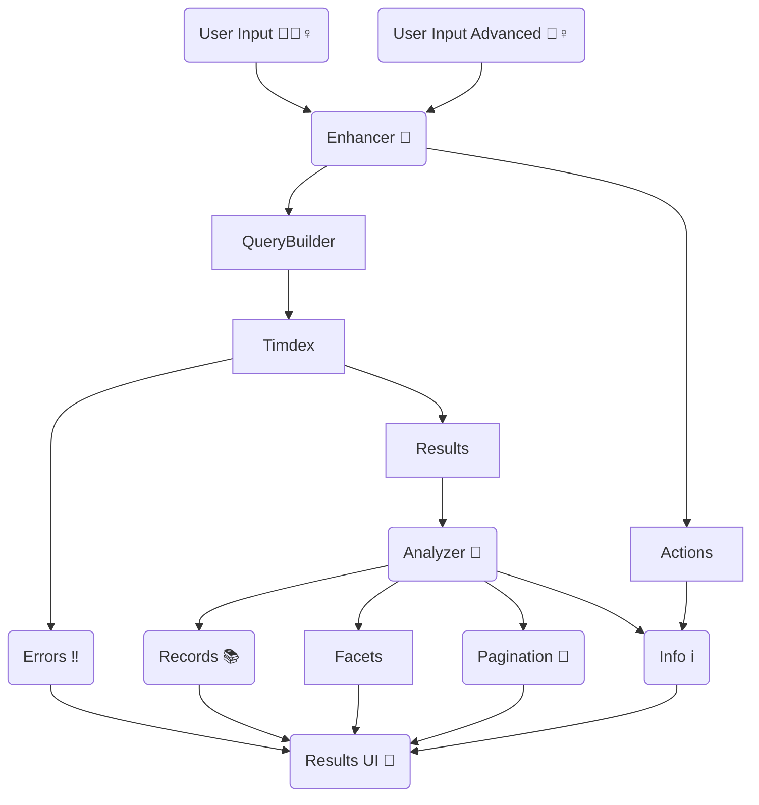

[](https://codeclimate.com/github/MITLibraries/timdex-ui/maintainability)

# TIMDEX UI

A discovery interface backed by [the TIMDEX API](https://github.com/MITLibraries/timdex).

## TIMDEX UI Flow Diagram

Note: this is a logical flow diagram and not a direct representation of object relationships. It is also a guide, not
a set of rules to follow. If implementation is done differently, please update this diagram to reflect that intentional
change as part of the work.



## Required Environment Variables

- `TIMDEX_GRAPHQL`: Set this to the URL of the GraphQL endpoint. There is no default value in the application.

## Optional Environment Variables

- `ABOUT_APP`: If populated, an 'about' partial containing the contents of this variable will render on 
`basic_search#index`.
- `ACTIVE_FILTERS`: If populated, this list of strings defines which filters are shown to the user, and the order in which they appear. Values are case sensitive, and must match those used in the TIMDEX GraphQL query. Extraneous values will be ignored. If not populated, all filters will be shown.
- `FILTER_CONTENT_TYPE`: The name to use instead of "Content type" for that filter / aggregation.
- `FILTER_CONTRIBUTOR`: The name to use instead of "Contributor" for that filter / aggregation.
- `FILTER_FORMAT`: The name to use instead of "Format" for that filter / aggregation.
- `FILTER_LANGUAGE`: The name to use instead of "Language" for that filter / aggregation.
- `FILTER_LITERARY_FORM`: The name to use instead of "Literary form" for that filter / aggregation.
- `FILTER_SOURCE`: The name to use instead of "Source" for that filter / aggregation.
- `FILTER_SUBJECT`: The name to use instead of "Subject" for that filter / aggregation.
- `GDT`: Enables features related to geospatial data discovery. Setting this variable with any value will trigger GDT
mode (e.g., `GDT=false` will still enable GDT features). Note that this is currently intended _only_ for the GDT app and
may have unexpected consequences if applied to other TIMDEX UI apps.
- `GLOBAL_ALERT`: The main functionality for this comes from our theme gem, but when set the value will be rendered as
  safe html above the main header of the site.
- `PLATFORM_NAME`: The value set is added to the header after the MIT Libraries logo. The logic and CSS for this comes from our theme gem.
- `SENTRY_DSN`: Client key for Sentry exception logging.
- `SENTRY_ENV`: Sentry environment for the application. Defaults to 'unknown' if unset.
- `TIMDEX_INDEX`: Name of the index, or alias, to provide to the GraphQL endpoint. Defaults to `nil` which will let TIMDEX determine the best index to use. Wildcard values can be set, for example `rdi*` would search any indexes that begin with `rdi` in the underlying OpenSearch instance behind TIMDEX.
- `TIMDEX_SOURCES`: Comma-separated list of sources to display in the advanced-search source selection element. This
  overrides the default which is set in ApplicationHelper.

### Test Environment-only Variables

- `SPEC_REPORTER`: Optional variable. If set, enables spec reporter style output from tests rather than minimal output.
- `TIMDEX_HOST`: Test Env only. Used to ensure the VCR cassettes can properly scrub specific host data to make sure we get the same cassettes regardless of which host was used to generate the cassettes. This should be set to the host name that matches `TIMDEX_GRAPHQL`. Ex: If `TIMDEX_GRAPHQL` is `https://www.example.com/graphql` then `TIMDEX_HOST` should be `www.example.com`.

## Generating VCR Cassettes

When generating new cassettes for timdex-ui, update `.env.test` to have appropriate values for your test for `TIMDEX_GRAPHQL` and `TIMDEX_HOST`. This will allow the cassettes to be generated from any TIMDEX source with the data you need, but be sure to set them back to the original values after the cassette are generated. When the values are not set to the "fake" values we normally store, many tests will fail due to how the cassettes re-write values to normalize what we store.

`.env.test` should be commited to the repository, but should not include real values for a TIMDEX source even though they are not secrets. We want to use fake values to allow us to normalize our cassettes without forcing us to always generate them from a single TIMDEX source.

## Updating GraphQL Schema

The schema for the GraphQL endpoint can be found at `/config/schema/schema.json`. This schema is used by the graphql-client gem, and so must be kept in sync with the Timdex GraphQL API. Updating the schema can be accomplished via the following command in the console:

```ruby
GraphQL::Client.dump_schema(TimdexBase::HTTP, 'config/schema/schema.json')
```
