# TIMDEX UI

A discovery interface backed by [the TIMDEX API](https://github.com/MITLibraries/timdex).

## TIMDEX UI Flow Diagram

Note: this is a logical flow diagram and not a direct representation of object relationships. It is also a guide, not
a set of rules to follow. If implementation is done differently, please update this diagram to reflect that intentional
change as part of the work.

```mermaid
  flowchart TD
    UserInput --> Enhancer
    UserInputAdvanced --> Enhancer

    Enhancer --> TimdexQueryBuilder

    TimdexQueryBuilder --> TimdexWrapper

    TimdexWrapper --> Results --> Analyzer
    TimdexWrapper --> Errors
    Errors --> UI

    Analyzer --> Records --> UI
    Analyzer --> Facets --> UI
    Analyzer --> Pagination --> UI
    Analyzer --> Info --> UI

    Enhancer --> Actions
    
    Actions --> Info

    Analyzer("Analyzer 🔎")
    Enhancer("Enhancer 🔎")
    Errors("Errors ‼️")
    Info("Info ℹ️")
    Pagination("Pagination 🔢")
    Records("Records 📚")
    UI("Results UI 🤩")
    UserInput("User Input 🤷🏽‍♀️")
    UserInputAdvanced("User Input Advanced 🦸‍♀️")
```

## Optional Environment Variables

- `TIMDEX_BASE`: value to override the default url for the TIMDEX API.
- `TIMDEX_TIMEOUT`: value to override the 6 second default for TIMDEX timeout.
