# TIMDEX UI

A discovery interface backed by [the TIMDEX API](https://github.com/MITLibraries/timdex).

## TIMDEX UI Flow Diagram

Note: this is a logical flow diagram and not a direct representation of object relationships. It is also a guide, not
a set of rules to follow. If implementation is done differently, please update this diagram to reflect that intentional
change as part of the work.

```mermaid
  flowchart TD
    UserInput --> Enhancer
    UserInputAdvanced --> Enhancer

    Enhancer --> TimdexQueryBuilder

    TimdexQueryBuilder --> TimdexWrapper

    TimdexWrapper --> Results --> Analyzer
    TimdexWrapper --> Errors
    Errors --> UI

    Analyzer --> Records --> UI
    Analyzer --> Facets --> UI
    Analyzer --> Pagination --> UI
    Analyzer --> Info --> UI

    Enhancer --> Actions
    
    Actions --> Info

    Analyzer("Analyzer 🔎")
    Enhancer("Enhancer 🔎")
    Errors("Errors ‼️")
    Info("Info ℹ️")
    Pagination("Pagination 🔢")
    Records("Records 📚")
    UI("Results UI 🤩")
    UserInput("User Input 🤷🏽‍♀️")
    UserInputAdvanced("User Input Advanced 🦸‍♀️")
```

## Required Environment Variables

- `TIMDEX_GRAPHQL`: Set this to the URL of the GraphQL endpoint. There is no default value in the application.

## Optional Environment Variables

- `TIMDEX_BASE`: value to override the default url for the TIMDEX API. Default is `https://timdex.mit.edu/api/v1/`
- `TIMDEX_TIMEOUT`: value to override the 6 second default for TIMDEX timeout.
- `TIMDEX_UI_ORIGIN`: Set this to the site making the calls to TIMDEX. Defaults to `http://localhost:3000` which is useful for development but unlikely correct elsewhere.

### Test Environment-only Variables

- `TIMDEX_HOST`: Test Env only. Used to ensure the VCR cassettes can properly scrub specific host data to make sure we get the same cassettes regardless of which host was used to generate the cassettes. This should be set to the host name that matches `TIMDEX_BASE` and `TIMDEX_GRAPHQL`. Ex: If `TIMDEX_BASE` is `https://www.example.com/api/v2` then `TIMDEX_HOST` should be `www.example.com`.

## Generating VCR Cassettes

When generating new cassettes for timdex-ui, update `.env.test` to have appropriate values for your test for `TIMDEX_BASE`, `TIMDEX_GRAPHQL`, `TIMDEX_HOST`, and `TIMDEX_UI_ORIGIN`. This will allow the cassettes to be generated from any TIMDEX source with the data you need, but be sure to set them back to the original values after the cassette are generated. When the values are not set to the "fake" values we normally store, many tests will fail due to how the cassettes re-write values to normalize what we store.

`.env.test` should be commited to the repository, but should not include real values for a TIMDEX source even though they are not secrets. We want to use fake values to allow us to normalize our cassettes without forcing us to always generate them from a single TIMDEX source.
