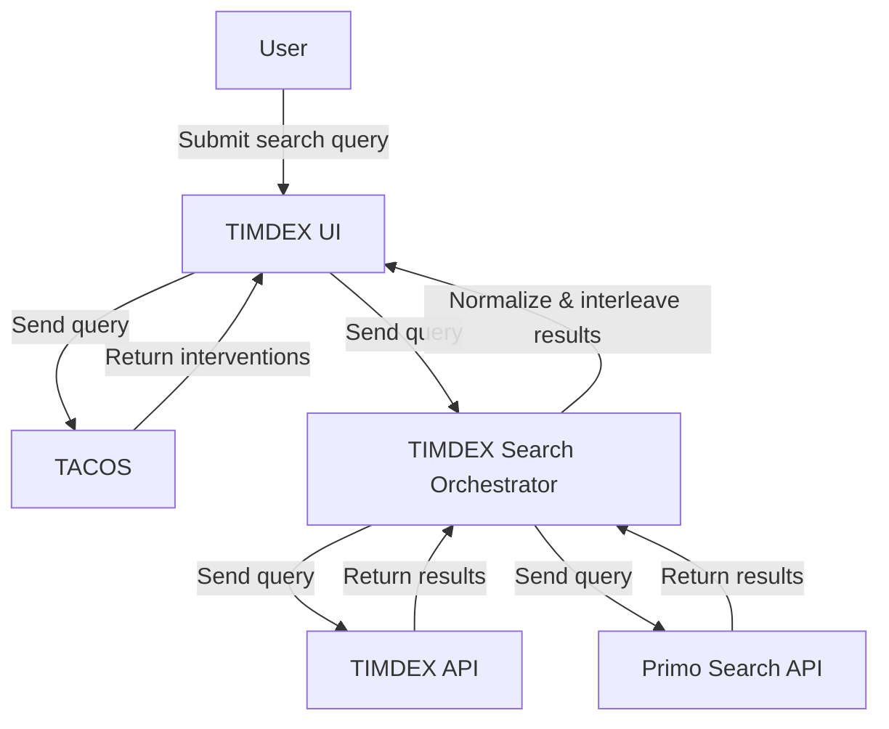

# 3. Surface Primo CDI records in results

Date: 2025-08-07

## Status

Accepted

## Context

The Libraries' unified search strategy calls for a discovery interface that surfaces results from
both Primo Central Discovery Index (CDI) and Alma (via TIMDEX), replacing the current [Bento UI](https://github.com/MITLibraries/bento).
In Bento, Alma and CDI results are displayed in separate boxes. The unified interface would
interleave CDI and TIMDEX records in the same results list.

## Options considered

### Harvest Primo CDI data

We considered adding a new Primo harvester to our ETL architecture to ingest CDI data into TIMDEX
API. This would allow us to normalize CDI records as we do with other TIMDEX sources. Querying a
single API for Alma and CDI records would facilitate a single-stream view as desired in the unified
UI. Interleaving would no longer be necessary, as all records would be stored in OpenSearch.

The harvester model would value beyond the scope of the TIMDEX UI redesign. By storing CDI records
in TIMDEX API, we could facilitate computational access to a massive corpus of data.

Unfortunately, this approach is not feasible for many reasons:

- **Cost**: CDI contains over 5 billion records. Harvesting and storing these records would be impractical and expensive, both in terms of financial and compute resources.
- **Performance**: Expanding TIMDEX API at such a scale is likely to dramatically reduce the efficiency of our OpenSearch index.
- **Data availability**: Because Primo does not expose CDI records in OAI-PMH, we would need to harvest using the Primo Search API, making the process needlessly complex and perhaps impossible.
- **Licensing**: Harvesting CDI records for TIMDEX likely has licensing implications. Ex Libris seems to discourage the practice, as Primo does not provide OAI-PMH support, and the Search API caps records per request at 5,000 via the [`offset` parameter](https://developers.exlibrisgroup.com/primo/apis/docs/primoSearch/R0VUIC9wcmltby92MS9zZWFyY2g=/#output:~:text=Note%3A%20The%20Primo%20search%20API%20has%20a%20hardcoded%20offset%20limitation%20parameter%20of%205000.).

### Display separate result streams in tabbed views

This option would essentially be a different take on the Bento design. On the results page, a user
could tab between Alma results (labeled 'Books', 'MIT Catalog', etc.) and CDI results ('Articles').

While arguably an improvement on Bento, this design does not deliver the combined Alma/CDI results
view as envisioned in the unified UI. 

### Implement external search orchestrator

In this approach, we would surface CDI records in TIMDEX UI by querying the Primo Search API
directly at runtime and interleaving results with TIMDEX API results in the unified search
interface.

To achieve this, we would implement a search orchestrator that receives a query from TIMDEX UI and
dispatches it in parallel to TIMDEX API and Primo Search API. The orchestrator would normalize and
interleave the results before returning them to the UI. This would allow us to display Alma and
CDI results in the same results list, without the feasibility concerns inherent in ingesting CDI
records into TIMDEX API.

## Decision

This approach aligns with the unified search strategy's goal to display all known results from
CDI and TIMDEX in the same interface. It also enables us to add the desired intelligent user
guidance, because we can render search interventions from TACOS and other external systems as
needed.

### Proposed architecture

The UI will dispatch the query in parallel to TACOS and the search orchestrator. TACOS responses are
then rendered immediately. The orchestrator waits for both TIMDEX and CDI responses, normalizes and
interleaves them, and returns a unified result set. This separation of concerns allows TACOS to
operate independently while the orchestrator handles result merging.

This architecture abstracts out most of the added complexity to the search orchestrator. The UI
will be responsible only for sending queries to external systems and rendering the returned data.
This abstraction will improve our discovery environment's maintainability by avoiding excessively
complex codebases.

### Relevance normalization

The interleaving of results from TIMDEX and CDI introduces the problem of relevance normalization.
While it is beyond the scope of this ADR to identify a solution this problem, it is something we
should consider as an important future step.

Primo uses an opaque, proprietary relevance algorithm. While the algorithm is
[somewhat customizable](https://knowledge.exlibrisgroup.com/Primo/Product_Documentation/020Primo_VE/Primo_VE_(English)/040Search_Configurations/Configuring_the_Ranking_of_Search_Results_in_Primo_VE),
we cannot assume any correlation between Primo scores and Okapi BM25 scores.

Premature optimization is a risk here. If we normalize scores without understanding what results
are actually useful, we might miss an opportunity to improve the search experience. Therefore, we
should avoid implementing relevance normalization until we have useful analytics. These might
include:

- Score distribution from each source
- User interaction data (e.g., do users click on CDI records more than TIMDEX records?)
- Usability testing data

We could begin by implementing rank-based interleaving (i.e., the first two results in the unified
list would be the first two results from each source). While naive, such an algorithm would provide
a baseline heuristic against which to measure future normalization attempts.

Once we have more information, we could then evaluate different normalization strategies. Techniques
like [min-max](https://opensearch.org/blog/how-does-the-rank-normalization-work-in-hybrid-search/#:~:text=3.%20Min%2Dmax%20normalization%20technique)
or [z-score](https://spotintelligence.com/2025/02/14/z-score-normalization/) would be relatively
easy to implement. However, in order to make scores semantically comparable, it seems likely that we
would need an ML-backed approach that could also help with reranking.

To that end, **we should strongly consider writing the search orchestrator in Python**, due to
greater availability of ML libraries. Alternatively, we can write the orchestrator in Rails and
tack on the normalization component as a Python microservice.

## Consequences

### Pros

- Avoids duplicating CDI data or violating licensing terms.
- Enables real-time access to CDI content via Primo Search API.
- Supports the unified search vision without overloading TIMDEX API.

### Cons

- Requires runtime integration with Primo Search API, which may introduce latency or complexity. (We can mitigate this by implementing a caching strategy similar to that in Bento.)
- Limits computational access to CDI records (no bulk access via TIMDEX). While not a TIMDEX UI concern, this is worthy of consideration in the broader context of the TIMDEX ecosystem.
- Mixed-source results may confuse end users.

### Future Considerations

Usability testing and analytics will inform how we refine this feature. Depending on how users
interact with the single-stream UI, we may need visual clarification of each record's source API, or 
separate tabs for TIMDEX and Primo records.

Relevance normalization is a critical issue. We can begin with rank-based interleaving, but we
should not assume this to be a long-term solution.

We should connect with the MIT research community to determine whether computational access to CDI
would be useful. If there is a need, we could consider harvesting a subset of CDI records relevant
to the use case. This would be a significant undertaking beyond the scope of the unified search
interface, but it aligns with the Libraries' mission, vision, and goals.