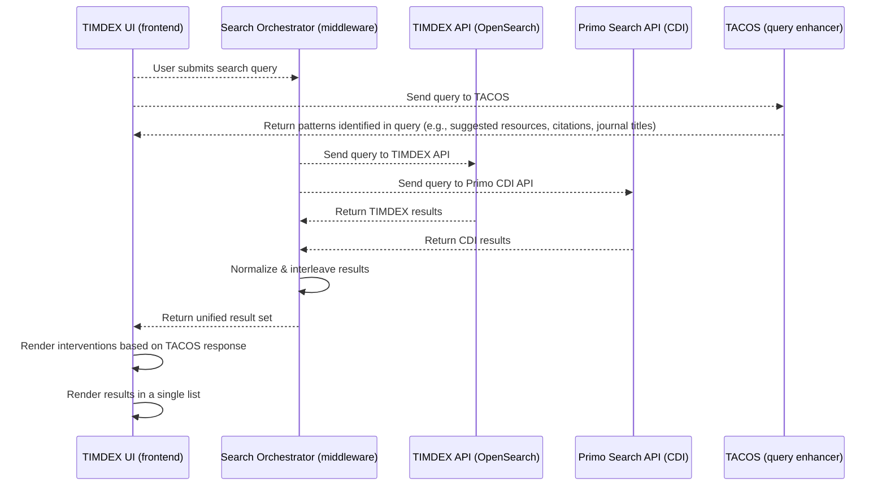

# 3. Surface Primo CDI records in results

Date: 2025-08-07

## Status

Accepted

## Context

The Libraries' unified search strategy calls for a discovery interface that surfaces results from
both Primo Central Discovery Index (CDI) and Alma (via TIMDEX), replacing the current [Bento UI](https://github.com/MITLibraries/bento).
In Bento, Alma and CDI results are displayed in separate boxes. The unified interface would
interleave CDI and TIMDEX records in the same results list.

We considered adding a new Primo harvester to our ETL architecture to ingest CDI data into TIMDEX
API. However, this approach is not feasible for many reasons:

- **Cost**: CDI contains over 5 billion records. Harvesting and storing these records would be impractical and expensive, both in terms of financial and compute resources.
- **Performance**: Expanding TIMDEX API at such a scale is likely to dramatically reduce the efficiency of our OpenSearch index.
- **Data availability**: Because Primo does not expose CDI records in OAI-PMH, we would need to harvest using the Primo Search API, making the process needlessly complex and perhaps impossible.
- **Licensing**: Harvesting CDI records for TIMDEX likely has licensing implications. Ex Libris seems to discourage the practice, as Primo does not provide OAI-PMH support, and the Search API caps records per request at 5,000 via the [`offset` parameter](https://developers.exlibrisgroup.com/primo/apis/docs/primoSearch/R0VUIC9wcmltby92MS9zZWFyY2g=/#output:~:text=Note%3A%20The%20Primo%20search%20API%20has%20a%20hardcoded%20offset%20limitation%20parameter%20of%205000.).

## Decision

We will surface CDI results in TIMDEX UI by querying the Primo Search API directly at runtime and
interleaving results with TIMDEX API results in the unified search interface.

To achieve this, we will implement a search orchestrator that receives a query from TIMDEX UI and
dispatches it in parallel to TIMDEX API and Primo Search API. The orchestrator will normalize and
interleave the results before returning them to the UI.

This approach aligns with the unified search strategy's goal to display all known results from
CDI and TIMDEX in the same interface. It also enables us to add the desired intelligent user
guidance, because we can render search interventions from TACOS and other external systems as
needed.

### Proposed architecture

Search form submissions will be sent in parallel to the search orchestrator and TACOS (possibly
using Turbo frames, but implementation details are TBD). This will allow us to continue rendering
TACOS interventions rapidly, likely before results are returned to the UI.

The orchestrator will make asynchronous calls to the TIMDEX and Primo Search APIs. Records in each
response will be normalized and interleaved into a unified set of results, then returned back to
TIMDEX UI. In addition to record metadata, relevance scores must also be normalized due to the
disparate sources. (See 'Relevance normalization' below for more details.)

This architecture abstracts out most of the added complexity to the search orchestrator. The UI
will be responsible only for sending queries to external systems and rendering the returned data.
This abstraction will improve our discovery environment's maintainability by avoiding excessively
complex codebases.

### Relevance normalization

The interleaving of results from TIMDEX and CDI introduces the problem of relevance normalization.
While it is beyond the scope of this ADR to identify a solution this problem, it is something we
should consider as an important future step.

Primo uses an opaque, proprietary relevance algorithm. While the algorithm is
[somewhat customizable](https://knowledge.exlibrisgroup.com/Primo/Product_Documentation/020Primo_VE/Primo_VE_(English)/040Search_Configurations/Configuring_the_Ranking_of_Search_Results_in_Primo_VE),
we cannot assume any correlation between Primo scores and Okapi BM25 scores.

Premature optimization is a risk here. If we normalize scores without understanding what results
are actually useful, we might miss an opportunity to improve the search experience. Therefore, we
should avoid implementing relevance normalization until we have useful analytics. These might
include:

- Score distribution from each source
- User interaction data (e.g., do users click on CDI records more than TIMDEX records?)
- Usability testing data

We could begin by implementing rank-based interleaving (i.e., the first two results in the unified
list would be the first two results from each source). While naive, such an algorithm would provide
an heuristic against which to measure future normalization attempts.

Once we have more information, we could then evaluate different normalization strategies. Techniques
like [min-max](https://opensearch.org/blog/how-does-the-rank-normalization-work-in-hybrid-search/#:~:text=3.%20Min%2Dmax%20normalization%20technique)
or [z-score](https://spotintelligence.com/2025/02/14/z-score-normalization/) would be relatively
easy to implement. However, in order to make scores semantically comparable, it seems likely that we
would need an ML-backed approach that could also help with reranking.

To that end, **we should strongly consider writing the search orchestrator in Python**, due to
greater availability of ML libraries. Alternatively, we can write the orchestrator in Rails and
tack on the normalization component as a Python microservice.

## Consequences

### Pros

- Avoids duplicating CDI data or violating licensing terms.
- Enables real-time access to CDI content via Primo Search API.
- Supports the unified search vision without overloading TIMDEX API.

### Cons

- Requires runtime integration with Primo Search API, which may introduce latency or complexity. (We can mitigate this by implementing a caching strategy similar to that in Bento.)
- Limits computational access to CDI records (no bulk access via TIMDEX).
- Mixed-source results may confuse end users.

### Future Considerations

Usability testing and analytics will inform how we refine this feature. Depending on how users
interact with the single-stream UI, we may need visual clarification of each record's source API, or 
separate tabs for TIMDEX and Primo records.

Relevance normalization is a critical issue. We can begin with rank-based interleaving, but we
should not assume this to be a long-term solution.

As previously mentioned, this solution does not provide computational access to CDI records via
TIMDEX. We should connect with the MIT research community to determine whether such access would
be useful. If there is a need, we could consider harvesting a subset of CDI records relevant to the
use case.